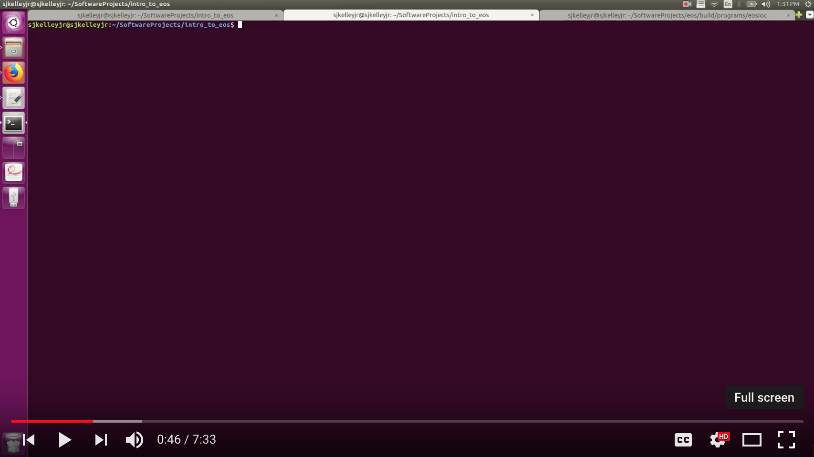
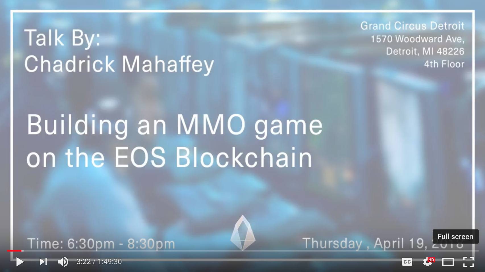

	</a>
	
	
	
	

	

# EOS Dev Learning Resources

A curated list of EOS development learning resources.

### Official

- [developers.eos.io](https://developers.eos.io).

### Videos

****

<b>Introduction to Blockchain: Daniel Larimer at Virginia Tech</b>

	

****

<b>What is EOS and How it Works?</b>

	

****

<b>The Real Difference Between Ethereum and EOS</b>

	

****

<b>C++ Programming - Entire CPP Programming Language in one Video</b>

	

****

<b>WebAssembly Tutorial - An Introduction to WebAssembly</b>

	

***

<b>EOS Educational Series - Introduction</b>

	

***

<b>EOS Educational Series - Internal Economics</b>

	

***

<b>Programming on EOS vs ETH - Programmer explains</b>

	

***

<b>Building Distributed Apps With EOS.IO Blockchain</b>

	

***

<b>Learning Blockchain with EOS and C++ Video Series</b>

	

***

<b>Building an MMO Game on the EOS Blockchain</b>

	

### Articles

- [Your First EOS dApp — The Contract](https://medium.com/coinmonks/your-first-eos-dapp-the-contract-ce793f43d852)
- [EOS smart contracts, Part 1: Getting started (Ping equivalent in EOS)](https://steemit.com/devs/@eos-asia/eos-smart-contracts-part-1-getting-started-ping-equivalent-in-eos)
- [First Steps in EOS Blockchain Development](https://medium.com/@infinitexlabs/first-steps-in-eos-blockchain-development-56824502c799)
- [The Ultimate End-to-End EOS dApp Development Tutorial — Part 1](https://medium.com/coinmonks/the-ultimate-end-to-end-eos-dapp-development-tutorial-part-1-2f99c512086c)
- [EOS Development Learning Resources](https://medium.com/coinmonks/eos-development-learning-resources-d6875196b980)
- [Blockgeeks - EOS Blockchain](https://blockgeeks.com/guides/eos-blockchain/)

### Github

- [EOS-Nation/Awesome-EOS](https://github.com/EOS-Nation/Awesome-EOS)
- [DanailMinchev/awesome-eos](https://github.com/DanailMinchev/awesome-eos)
- [eosasia/ping-eos](https://github.com/eosasia/ping-eos)
- [EOSEssentials/Scatter-Demo](https://github.com/EOSEssentials/Scatter-Demos)
- [rawrat/eos-poc](https://github.com/rawrat/eos-poc)
- [tbfleming/cib](https://github.com/tbfleming/cib)

## Websites

- [eosdocs.io](https://eosdocs.io/)
- [eosvenezuela.io/esc](https://eosvenezuela.io/esc.html)
- [eosio.stackexchange.com](https://eosio.stackexchange.com/)

## About EOS Costa Rica

EOS Blockchain is aiming to become a decentralized operating system which can support large-scale decentralized applications.

EOS Costa Rica supports the global and local open source efforts and development communities by maintaining and contribute to open source initiatives, meetups and workshops.

We challenge ourselves to provide the EOS platform with a strong geographical and political diversity by running the most robust EOS Block Producer possible from Costa Rica; We pledge to leverage our talent, experience, and sustainable internet resources to meet such an important challenge.

[eoscostarica.io](https://eoscostarica.io)
